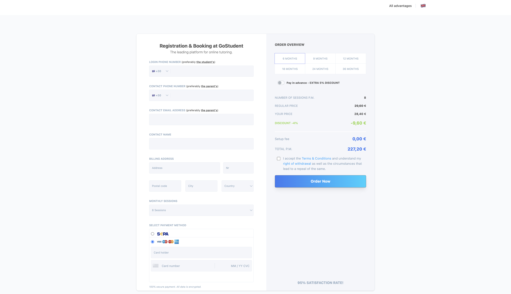
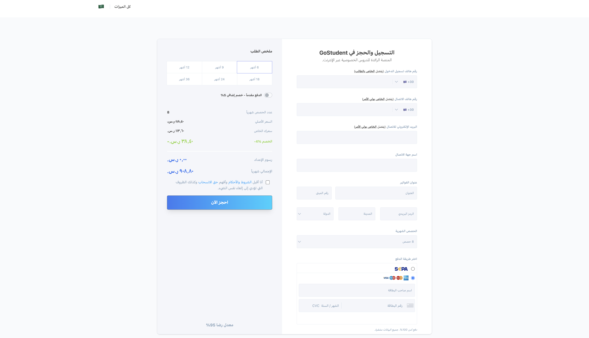
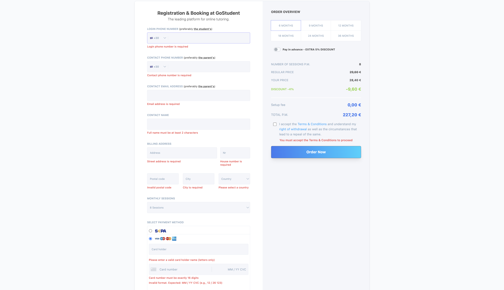
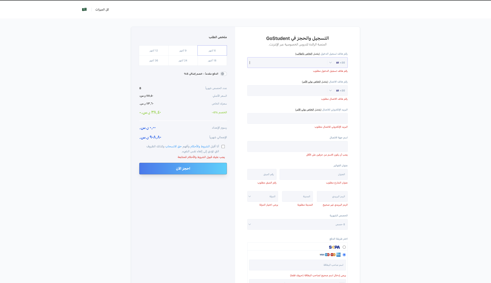
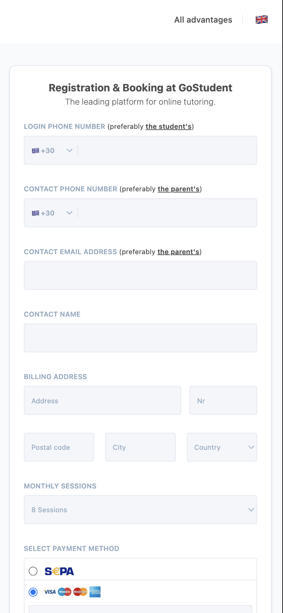
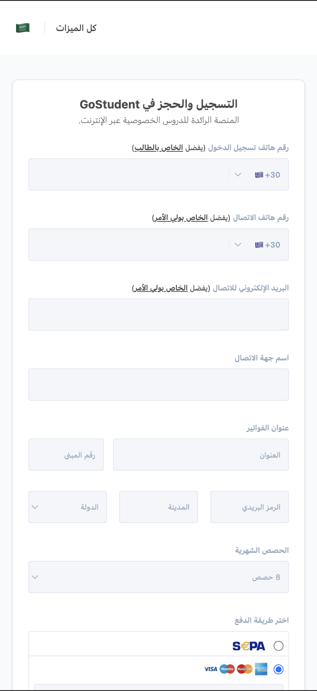
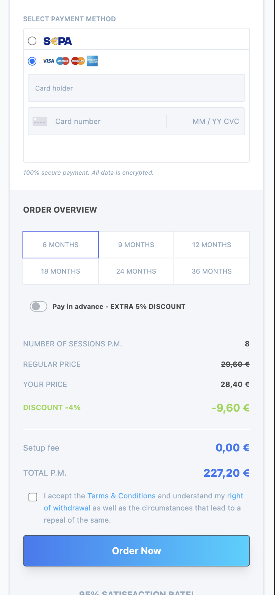
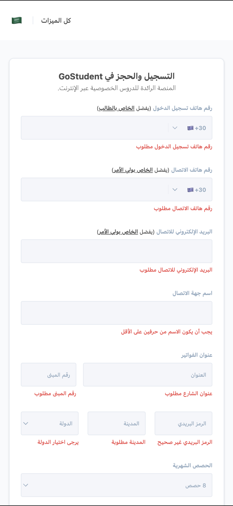

<p align="center">
  
</p>

# GoStudent Booking Widget Clone

A high-performance, dynamic checkout and registration form cloned from GoStudent's booking ecosystem. Engineered using **React 19**, **TypeScript 5**, and **Tailwind CSS v4.0**, bridging responsive visual accuracy with robust form validation and dual-language localization, fully integrated as a **WordPress Custom Plugin**.

<div align="center">


<br />


<br />
<br />

[**🌐 Live Demo**](https://gostudent-booking-widget.vercel.app/)

</div>

---

## 🌟 Key Features & Engineering Achievements

- **Robust Form Validation (React Hook Form + Zod):** Fully schema-driven form state with conditional logic. Visa card fields are dynamically validated only when the corresponding payment option is selected.
- **Dual-Language & RTL Layout (English / Arabic):** Instant UI translation with automatic viewport layout mirroring (`dir="rtl"` / `dir="ltr"`). Includes persistent storage of language preference using `localStorage`.
- **Dynamic Price & Multi-Currency Converter:** Real-time billing calculation based on selected sessions and month package. Includes an automated currency converter translating `EUR (€)` to localized `SAR (ر.س)` for Arabic layouts.
- **React 19 Native Ref Forwarding:** Modern implementation of reference forwarding on custom atomic UI inputs (`Input` and `Select`) without requiring legacy `forwardRef` wrappers.
- **WordPress Plugin Compatibility:** Fully bundled static build ready to be loaded as a native WordPress plugin via a custom registered Shortcode.
- **Premium UX Alerts:** Beautiful interactive success modals utilizing custom-branded **SweetAlert2** theme with localized RTL timer progress bar.

---

## 📸 Visual Journey

### 🖥️ Desktop Interface (English vs. Arabic Layouts)

|  Desktop View (English Layout & EUR Currency)   | Desktop View (Arabic RTL Layout & SAR Currency) |
| :---------------------------------------------: | :---------------------------------------------: |
|  |  |
|           _Standard European Layout_            |      _Dynamic RTL Grid with Localized SAR_      |

---

### 🚨 Robust Form Validation (English vs. Arabic Errors)

|              Validation Errors (English UI)               |             Validation Errors (Arabic RTL UI)             |
| :-------------------------------------------------------: | :-------------------------------------------------------: |
|  |  |
|                 _English Error Feedbacks_                 |               _Arabic RTL Error Feedbacks_                |

---

### 📱 Mobile-First Excellence (Responsive Design)

|                 Mobile Form (English)                  |                 Mobile Form (Arabic RTL)                  |                     Mobile Order Summary                     |               Mobile Validation (Arabic)               |
| :----------------------------------------------------: | :-------------------------------------------------------: | :----------------------------------------------------------: | :----------------------------------------------------: |
|  |  |  |  |
|                _Responsive Left Column_                |                   _Responsive RTL Form_                   |                    _Responsive Overview_                     |                _RTL Mobile Validation_                 |

---

## 🏗️ Project Architecture & Directory Structure

The project maintains a highly modular directory layout separating core business logic, visual components, schemas, and configurations:

```text
gostudent-booking-widget/
├── dist/                          # Production Build: Optimised assets directory
│   └── assets/                    # Compiled index.js & index.css (static naming)
│
├── src/
│   ├── components/
│   │   ├── form/                  # Domain/Composite Form Fields
│   │   │   ├── CardDetailsInput.tsx
│   │   │   ├── CheckoutForm.tsx
│   │   │   ├── OrderSummary.tsx
│   │   │   └── PhoneInput.tsx
│   │   └── ui/                    # Reusable Atomic UI Elements (React 19 Refs)
│   │       ├── Input.tsx
│   │       ├── Select.tsx
│   │       └── Title.tsx
│   │
│   ├── constants/                 # Immutable Data (Pricing tiers, countries, translations)
│   │   ├── countries.ts
│   │   ├── pricing.ts
│   │   └── translations.ts        # Dynamic localization dictionary
│   │
│   ├── utils/                     # Custom Utilities & Validation logic
│   │   ├── cn.ts
│   │   ├── formatCurrency.ts
│   │   └── validationSchema.ts    # Zod registration schema & TypeScript Types
│   │
│   ├── App.tsx                    # Main App Controller (Form State & submit handler)
│   ├── index.css                  # Tailwind CSS configuration with custom variables
│   └── main.tsx                   # Client-side React bootstrap entrypoint
│
├── gostudent-booking-widget.php   # Main WordPress Plugin PHP Wrapper
├── vite.config.ts                 # Build & Asset Bundling configurations
└── package.json                   # Project packages & automation scripts
```

---

## 🛡️ Technical Implementation Details (What We Did)

### 1. Zod Conditional Schema Validation

To avoid clunky and unreliable custom verification on credit card fields, the validation is driven by a central Zod schema. Using `.superRefine()`, card details (`cardNumber`, `expiryAndCvc`, `cardHolder`) are conditionally required and validated with strict regex patterns only if the selected `paymentMethod` is `"visa"`.

### 2. Modern React 19 Ref Passing

Taking advantage of the latest stable React 19 releases, custom atom UI elements (`Input`, `Select`) do not use the deprecated, verbose `React.forwardRef()`. Instead, `ref` is passed down as a native prop directly to the underlying HTML element, keeping the typescript types clean and readable.

### 3. Dynamic Currency & Localization Helper

Localization isn't just about text translation. When switching to Arabic:

- The price numbers and discount values are wrapped in `<span dir="ltr">` to prevent layout engines from reversing the negative minus signs and currency symbols.
- We created a centralized `translateError` helper function that maps the English Zod error strings directly into localized Arabic strings instantly inside the UI layer.
- The pricing currency dynamically converts from Euros to Saudi Riyal (SAR) using real-time locale-sensitive formats (`ar-SA` vs `de-DE`).

---

## 🔌 WordPress Integration & Shortcode Usage

This widget is designed to be installed directly as a WordPress Plugin.

### How it works:

1. The **`gostudent-booking-widget.php`** file contains standard WordPress headers, prompting WordPress to recognize it in the Admin Dashboard.
2. It registers a custom shortcode `[gostudent_booking]`.
3. When activated, it enqueues the production-built assets `dist/assets/index.js` and `dist/assets/index.css`.
4. It returns `<div id="root"></div>`, which serves as the mounting target for the React 19 Single Page App.

### To use it:

Simply write `[gostudent_booking]` inside any classic WordPress Editor page, Block Editor, or Elementor text widget!

---

## 🛠️ Installation & Local Setup

To run this project locally for development, follow these steps:

### 1. Clone the repository

```bash
git clone https://github.com/HossamGezo/gostudent-booking-widget.git
cd gostudent-booking-widget
```

### 2. Install dependencies

```bash
npm install
```

### 3. Run development server (with hot reload)

```bash
npm run dev
```

### 4. Build for production (WordPress Bundle)

```bash
npm run build
```

The output files will be written with predictable static names directly into `dist/assets/` ready for WordPress.

---

## 👨‍💻 Connect with Me

- **LinkedIn:** [Hossam Gouda](https://www.linkedin.com/in/hossam-gouda-software-engineer)
- **GitHub:** [Hossam Gouda](https://github.com/HossamGezo)
- **Email:** hossamgouda27@gmail.com

---

Developed with absolute dedication by **Hossam Gouda**  
**Front-End Engineer focused on building scalable, maintainable, and pixel-perfect user interfaces.**
